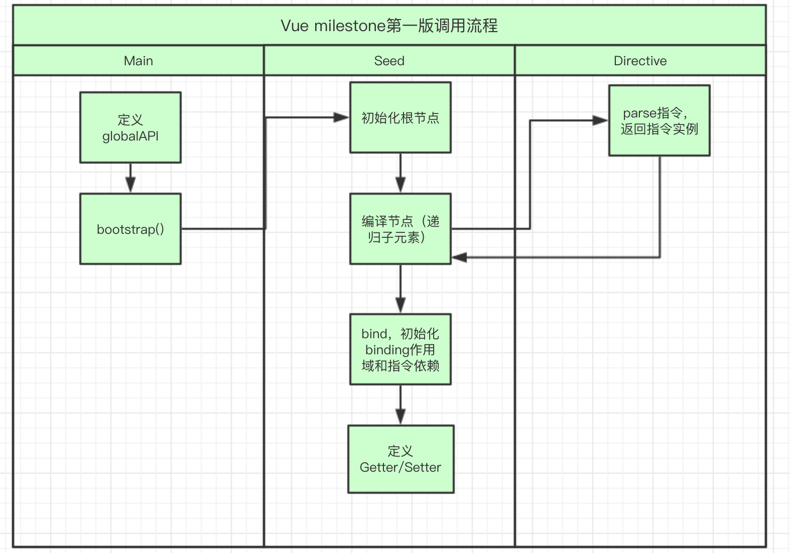

## HTML 结构

让我们将历史 check 到`83665f99`，该提交被作者命名为`milestone reached`，可以看做是一次小的里程碑。
在这个版本的设计中，HTML 结构设计更为丰富：

```html
<div id="app" sd-controller="TodoList" sd-on="click:changeMessage | delegate .button">
    <p sd-text="msg | capitalize"></p>
    <p sd-text="msg | uppercase"></p>
    <p sd-on="click:remove">bye</p>
    <p sd-text="total | money"></p>
    <p class="button">Change Message</p>
    <p sd-class="red:error" sd-show="error">Error</p>
    <ul sd-show="todos">
        <li class="todo"
            sd-controller="Todo"
            sd-each="todo:todos"
            sd-class="done:todo.done"
            sd-on="click:changeMessage, click:todo.toggle"
            sd-text="todo.title"
        ></li>
    </ul>
</div>
```

可以看到，相比于第一次提交，这个版本实现了比较有标志性的两个指令：

- sd-controller
- sd-each

## 启动器设计

在这个版本中，Vue 模仿了 Angular 的 API，设计了 bootstrap 方法，作为整个框架的入口：

```javascript
var app = Seed.bootstrap({
  el: "#app",
  data: data
});
```

其实现也非常的简单，核心逻辑是对 Seed 进行实例化，兼容支持数组传参调用：

```javascript
Seed.bootstrap = function(seeds) {
  if (!Array.isArray(seeds)) seeds = [seeds];
  var instances = [];
  seeds.forEach(function(seed) {
    var el = seed.el;
    if (typeof el === "string") {
      el = document.querySelector(el);
    }
    if (!el) console.warn("invalid element or selector: " + seed.el);
    instances.push(new Seed(el, seed.data, seed.options));
  });
  return instances.length > 1 ? instances : instances[0];
};
```

## sd-controller 的实现

`sd-controller`的实现在这个版本中非常简单，在整个 Seed 实例被初始化时，会检测该 root 元素上是否有指令：

```javascript
// if has controller
var ctrlID = el.getAttribute(ctrlAttr),
  controller = null;
if (ctrlID) {
  controller = controllers[ctrlID];
  el.removeAttribute(ctrlAttr);
  if (!controller) throw new Error("controller " + ctrlID + " is not defined.");
}
```

如果有指令，且该指令已经被定义，则在整个 binding 初始化完成后，调用该指令的绑定方法：

```javascript
// copy in methods from controller
if (controller) {
  controller.call(null, this.scope, this);
}
```

以上述 HTML 为例，在根元素上定义了`sd-controller`：

```html
<div id="app" sd-controller="TodoList" sd-on="click:changeMessage | delegate .button">
</div>
```

且在实例化前定义了该 Controller：

```javascript
Seed.controller("TodoList", function(scope, seed) {
  console.log("controller invoked");
  scope.changeMessage = function() {
    scope.msg = (Math.random() * 100).toFixed(2) + "% awesomeness";
  };
  scope.remove = function() {
    seed.destroy();
  };
});
```

则在整个 scope 初始化完成后，回调该 Controller 的定义方法，在这里对 scope 里的方法进行赋值定义，即可触发对应 binding 的 Setter，从而触发指令的更新。

经观察我们还可以发现，上述结构中还有一处调用`sd-controller`的地方：

```html
<li class="todo"
    sd-controller="Todo"
    sd-each="todo:todos"
    sd-class="done:todo.done"
    sd-on="click:changeMessage, click:todo.toggle"
    sd-text="todo.title"
></li>
```

在这个版本中，只实现了对根元素的 controller 绑定，那么这里的 Controller 又是什么意思呢？接下来我们需要在复杂的`sd-each`指令中寻找答案。

## sd-each 的实现

对于 sd-each 指令的支持，在节点的 compile 过程中，会进行单独的逻辑处理：

```javascript
if (eachExp) {
  // each block

  var binding = bindingParser.parse(eachAttr, eachExp);
  if (binding) {
    self._bind(node, binding);
    // need to set each block now so it can inherit
    // parent scope. i.e. the childSeeds must have been
    // initiated when parent scope setters are invoked
    self.scope[binding.key] = self._dataCopy[binding.key];
    delete self._dataCopy[binding.key];
  }
}
```

可以看到，首先和其他指令一样，对指令进行 parse 和 bind 操作，最后直接对 scope 进行赋值触发 Setter，从而触发指令的 update 方法，原因如注释所写，在触发 update 时会初始化 each 指令的所有 childSeeds。

接下来看看指令的实现，首先被调用的是 bind 方法：

```javascript
module.exports = {
  bind: function() {
    this.el.removeAttribute(config.prefix + "-each");
    this.prefixRE = new RegExp("^" + this.arg + ".");
    var ctn = (this.container = this.el.parentNode);
    this.marker = document.createComment("sd-each-" + this.arg + "-marker");
    ctn.insertBefore(this.marker, this.el);
    ctn.removeChild(this.el);
    this.childSeeds = [];
  }
};
```

在 bind 方法里面，主要做了两件事：

- 生成了一个列表变量的前缀正则
- 插入了一条 marker 注释节点，移除了本身 DOM

初看这里的逻辑似乎有些迷惑，让我们接着看下 update 方法做了什么事，因为 update 也紧接着 bind 被触发：

```javascript
module.exports = {
  update: function(collection) {
    if (this.childSeeds.length) {
      this.childSeeds.forEach(function(child) {
        child.destroy();
      });
      this.childSeeds = [];
    }
    watchArray(collection, this.mutate.bind(this));
    var self = this;
    collection.forEach(function(item, i) {
      self.childSeeds.push(self.buildItem(item, i, collection));
    });
    console.log("collection creation done.");
  }
};
```

在 update 时，首先 destroy 已有的子元素（childSeeds），然后调用 buildItem 方法生成新的列表，对于数组的 watch 暂且不论，在这个版本中 mutate 方法尚不完善。

触发 update 的时机，实际上是当我们把数组对象赋给 each 指令的 key 的时候，这时有可能是二次赋值，所以需要先销毁之前创建的所有子类。

接下来看看 buildItem 方法实现：

```javascript
module.exports = {
  buildItem: function(data, index, collection) {
    var Seed = require("./seed"),
      node = this.el.cloneNode(true);
    var spore = new Seed(node, data, {
      eachPrefixRE: this.prefixRE,
      parentSeed: this.seed
    });
    this.container.insertBefore(node, this.marker);
    collection[index] = spore.scope;
    return spore;
  }
};
```

buildItem 看似不好理解，实际上只是新建了一个 Seed 实例，并将原节点深拷贝了一份，插入到 Mark 节点前。

此时可以回答 build 的第一个问题，为什么要生成一条注释节点呢？
注释节点的作用是一条基准线，数组中的每一项初始化完毕后，都生成一个 node 节点，insertBefore 至 mark 节点前，保证重新插入的顺序。

那么 build 中 prefixRE 的作用是什么呢？首先我们来看看调用处的数据格式：

```javascript
todos: [
  {
    title: "hello!",
    done: true
  },
  {
    title: "hello!!",
    done: false
  },
  {
    title: "hello!!!",
    done: false
  }
];
```

```html
<li class="todo"
    sd-controller="Todo"
    sd-each="todo:todos"
    sd-class="done:todo.done"
    sd-on="click:changeMessage, click:todo.toggle"
    sd-text="todo.title"
></li>
```

注意 each 指令`todo:todos`的写法，实际上作者想要用这样的写法，做到该元素后续可以用`todo`来取到数组子元素的数据，并同时兼具响应式绑定，因此针对每一个子元素，都重新实例化了一个 Seed 对象，重新解析并绑定。但是，我们注意到在初始化时，传入的数据对象是：

```javascript
{
  title: "hello!!",
  done: false
}
```

那么如何在其他指令中使用`todo.title`这样的格式访问呢？这就是 prefixRE 做的事情，在进行 binding 之前，Vue 会检测正则：

```javascript
var key = bindingInstance.key,
  epr = this._options.eachPrefixRE,
  isEachKey = epr && epr.test(key),
  scopeOwner = this;
// TODO make scope chain work on nested controllers
if (isEachKey) {
  key = key.replace(epr, "");
} else if (epr) {
  scopeOwner = this._options.parentSeed;
}
```

如果 binding 的 key 匹配到了该正则，则会把`todo.`这样的字符全部置空，这样再进行绑定时就是首层数据了。
另外，如果没匹配到，但收到了这个正则，这个时候有可能需要访问的是父 scope 数据，所以我们将 scope 设置为父元素。

这样，`sd-on="click:changeMessage, click:todo.toggle"`这个指令才可以访问的到`changeMessage`方法，它是定义在父 Seed 的 scope 中的。

## 更清晰的主调用流程

在这一个 commit 之前，作者经过了多次重构调整，明确各模块的职责归属，获得了一个较为明晰的调用流程：


